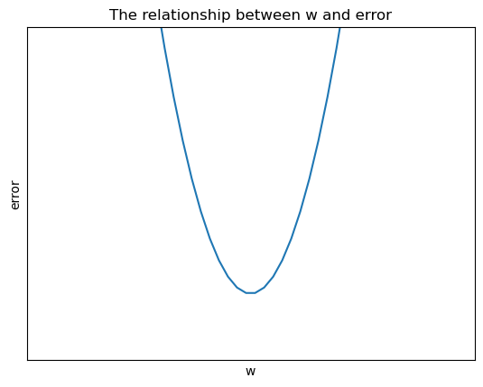

# 正規方程;勾配降下＆逆伝播
誤差を評価する方法

$y=1.2x$の場合

$\hat{y_1}=0.68, y_1=0.53, \delta_1=0.15$

$\hat{y_2}=0.22, y_2=0.37, \delta_2=-0.15$

$\sum\delta=0$

**方法1：**

絶対値を使用（つまり「絶対差」）

$|0.68-0.53|=0.15$

$|0.22-0.37|=0.15$

**方法2：**

平方誤差

$(0.68-0.53)^2=0.0225$

$(0.22-0.37)^2=0.0225$

**平方誤差が小さいほど、誤差が小さい**

パラメータ$w$は関数の形を決定し、$w$が異なる値を取るたびに、生成される誤差も異なります。

誤差と$w$の関係は以下の通りです。

一つのデータに対しては

$x=0.4$

$y=0.68$

$y=w*0.4$

$e=(0.68-w*0.4)^2$

$e=0.16*w^2+(-0.544)*w+0.4624$

全てのデータに対して

$y=w*x_0$

$e_0=(y_0-w*x_0)^2$

$e_0=x_0^2*w^2+(-2x_0y_0)*w+y_0^2$

$y=w*x_1$

$e_1=(y_1-w*x_1)^2$

$e_1=x_1^2*w^2+(-2x_1y_1)*w+y_1^2$

$y=w*x_2$

$e_2=(y_2-w*x_2)^2$

$e_2=x_2^2*w^2+(-2x_2y_2)*w+y_2^2$

$\vdots$

$y=w*x_n$

$e_n=(y_n-w*x_n)^2$

$e_n=x_n^2*w^2+(-2x_ny_n)*w+y_n^2$

$\frac{1}{m}\{(x_0^2+x_1^2+\cdots+x_m^2)w^2+(-2x_0y_0-2x_1y_1-\cdots-2x_my_m)w+(y_0^2+y_1^2+\cdots+y_m^2)\}$

$a=x_0^2+x_1^2+\cdots+x_m^2$

$b=-2x_0y_0-2x_1y_1-\cdots-2x_my_m$

$c=y_0^2+y_1^2+\cdots+y_m^2$

$\frac{1}{m}\cdot[aw^2+bw+c]$

$$
\begin{align}
e=\frac{1}{m}\sum_{i=0}^m(x_i^2*w^2+(-2x_iy_i)*w+y_i^2)\notag
\end{align}
$$

\( e \) が平均二乗誤差を表します。

コンピュータにパラボラの最低点を見つけさせます。

### **事物の発生頻度はその確率に収束します**

最初に\( w \) を推測し、次に大量のデータ（大きさ、毒性）を集めて\( w \) が適切かどうかを評価します。

このプロセスは**回帰分析**と呼ばれます。

評価基準は：**平均二乗誤差**

回帰分析の最小二乗法：

$$
\begin{align}
e=\frac{1}{m}\sum_{i=0}^m(y_{予測}-y_{答え})^2\notag
\end{align}
$$

観察された多くのデータを使用して、この関数が適切かどうかを評価します。

関数内の独立変数\( x \) と従属変数\( y \) は、環境から観察された多くの既知の数値です。

\( w \) を独立変数、誤差\( e \) を従属変数として、新しい関数である**コスト関数**が形成されます。

このコスト関数は、パラメータ\( w \) を異なる値で取ると、環境の問題データを予測する際に異なる誤差\( e \) が生じることを示します。

そして、コスト関数の最小値の\( w \)値を使用して、それを予測関数に戻します。

この時点で、予測関数はデータの適合を非常によく行います。

$y=f(x)=w_{min}x$

### だから、予測関数とコスト関数の違いに注意する必要があります。

**予測関数**

\( w \) はパラメータとして、\( x \) と\( y \) がそれぞれ独立変数の入力と従属変数の出力として機能します。

**コスト関数**

\( x \) と\( y \) は観測統計によって得られた既知の数値であり、コスト関数の既知のパラメータの部分となります。\( w \) は独立変数であり、誤差コスト\( e \) は従属変数です。

\( w \) を最小値に向かわせる方法

**方法1：（正規方程）**

抛物線の頂点の座標式

$$
\begin{align}
w=-\frac{b}{2a}\notag
\end{align}
$$

「データが1セットしかない場合」

$$
\begin{align}
e&=x_0^2*w^2+(-2x_0y_0)*w+y_0^2\notag\\
w&=-\frac{-2x_0y_0}{2x_0^2}\notag\\
w&=\frac{y_0}{x_0}\notag
\end{align}
$$

データが複数のグループを持つ場合

上記の方法は正規方程と呼ばれ、誤差を最小にする
𝑤
w の値を一度に求める方法です。

正規方程

$$
\begin{align}
w=(X^TX)^{-1}X^TY\notag
\end{align}
$$

