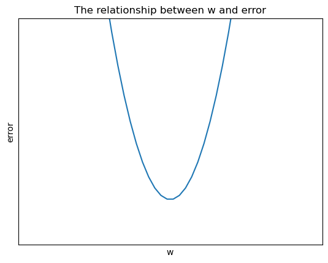

# 正規方程;勾配降下＆逆伝播
誤差を評価する方法

$y=1.2x$の場合

$\hat{y_1}=0.68, y_1=0.53, \delta_1=0.15$

$\hat{y_2}=0.22, y_2=0.37, \delta_2=-0.15$

$\sum\delta=0$

**方法1：**

絶対値を使用（つまり「絶対差」）

$|0.68-0.53|=0.15$

$|0.22-0.37|=0.15$

**方法2：**

平方誤差

$(0.68-0.53)^2=0.0225$

$(0.22-0.37)^2=0.0225$

**平方誤差が小さいほど、誤差が小さい**

パラメータ$w$は関数の形を決定し、$w$が異なる値を取るたびに、生成される誤差も異なります。

誤差と$w$の関係は以下の通りです。

